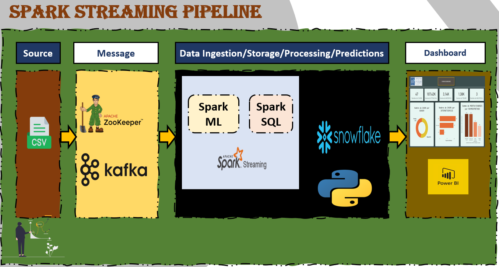

## Acknowledgments

I appreciate the contributions of the team members:
- [Soufiane Elghazi](https://github.com/SoufianeElghazi)
- [Yassine Ouahib](https://github.com/yassineouahib)

who worked on different aspects of the project.
</div><br>

<h1 style='color:yellow' align='center'>
    Spark Structred Streaming.
</h1>


</div><br>
<h1 style='color:yellow' align='center'>
    Spark Structured Streaming.
</h1>
<div style="background-color:white; color:black; font-size:15px; font-family:Comic Sans MS; padding:10px; border: 5px solid black;font-weight:bold;border-radius: 20px;">
We have developed a telecom churn prediction model using Pyspark. The notebook containing the EDA and model construction (Random Forest) is located in the folder <span style="color:orangered;">../SPARK_ML/ </span>
</div><br>
<div style="background-color:white; color:black; font-size:15px; font-family:Comic Sans MS; padding:10px; border: 5px solid black;font-weight:bold;border-radius: 20px;">
In this directory, we load and use the developed model located in <span style="color:purple;">Model/random_forest_model</span> to make predictions on the <span style="color:purple;">churn_dataset.csv</span> dataset.
</div><br>
<div style="background-color:white; color:black; font-size:15px; font-family:Comic Sans MS; padding:10px; border: 5px solid black;font-weight:bold;border-radius: 20px;">
This process begins by importing data line by line with Kafka to Spark Streaming, where transformations are executed. The model is loaded to make predictions, and the output is stored in Cassandra. The results are then visualized in real-time with PowerBi. All of this is done in real-time. <br> The following schema illustrates this process:
</div><br>
<div style="text-align:center;height:70;">
    
</div><br>
<div style="background-color:white; color:black; font-size:15px; font-family:Comic Sans MS; padding:10px; border: 5px solid black;font-weight:bold;border-radius: 20px;">
In this directory, you will find the following elements:
<ul>
    <li><span style="color:purple">WA_Fn-UseC_-Telco-Customer-Churn.csv :</span><span style="color:olive">Data file we are working with</span></li>
    <li><span style="color:purple">Model :</span><span style="color:olive">Contains our Random Forest model</span></li>
    <li><span style="color:purple">churn.py :</span><span style="color:olive">Contains the code to send data from the csv file to Kafka</span></li>
    <li><span style="color:purple">Streaming.py :</span><span style="color:olive">Contains the code to connect Spark with Kafka, perform data transformations, real-time prediction with Spark Structured Streaming, and import results to Snowflake</span></li>
    <li><span style="color:purple">ChurnDashboard.pbix :</span><span style="color:olive">Contains the visualization dashboard with data received from Snowflake using Power BI's DirectQuery functionality</span></li>
    <li><span style="color:purple">README.md :</span><span style="color:olive">Description of files with execution commands</span></li>
</ul>
</div><br>
<div style="background-color:olive; color:white; font-size:15px; font-family:Comic Sans MS; padding:10px; border: 5px solid black;font-weight:bold;border-radius: 20px;">
The first thing to do is to launch Zookeeper</div><br>

```bash
bin/zookeeper-server-start.sh config/zookeeper.properties
```

<div style="background-color:olive; color:white; font-size:15px; font-family:Comic Sans MS; padding:10px; border: 5px solid black;font-weight:bold;border-radius: 20px;">
Then start the Kafka server</div><br>

```bash
bin/kafka-server-start.sh config/server.properties
```

<div style="background-color:olive; color:white; font-size:15px; font-family:Comic Sans MS; padding:10px; border: 5px solid black;font-weight:bold;border-radius: 20px;">
Next, create a topic for our project called "churn"</div><br>
```bash
bin/kafka-topics.sh --create --topic churn --bootstrap-server localhost:9092
```

<div style="background-color:olive; color:white; font-size:15px; font-family:Comic Sans MS; padding:10px; border: 5px solid black;font-weight:bold;border-radius: 20px;">
Ensure that the topic is created by trying the following command</div><br>

```bash
bin/kafka-topics.sh --list --bootstrap-server localhost:9092
```

<div style="background-color:olive; color:white; font-size:15px; font-family:Comic Sans MS; padding:10px; border: 5px solid black;font-weight:bold;border-radius: 20px;">Then change the directory to the project folder, and execute the Python file to send data from the csv file line by line to the "churn" topic in Kafka, acting as a producer</div><br>

```bash
cd churn-project
python3 churn.py
```

<div style="background-color:olive; color:white; font-size:15px; font-family:Comic Sans MS; padding:10px; border: 5px solid black;font-weight:bold;border-radius: 20px;">Finally, execute our Pyspark application, which takes this data from Kafka as a consumer, performs the necessary transformations, makes real-time predictions, and finally sends the results to Snowflake</div><br>

```bash
spark-submit --packages org.apache.spark:spark-sql-kafka-0-10_2.12:3.5.0,net.snowflake:spark-snowflake_2.12:2.10.0-spark_3.2 Streaming.py
```

<div style="background-color:gray; color:white; font-size:15px; font-family:Comic Sans MS; padding:10px; border: 5px solid black;font-weight:bold;border-radius: 20px;text-align:center"> ✨ THE END ✨</div><br>
